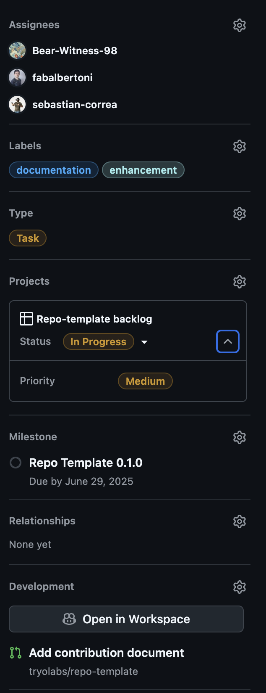

# Repo template contriburion guideline

The purpose of this document is to establish an organized process for documenting and requesting changes to the repo-template. This guideline is here to make contributions more efficient, enabling you to document bugs or suggest new features whenever you have the opportunity.

> [!NOTE]
> This guideline is specific to developing features or fixing bugs in the `repo-template` repo, and is not intented to be used in the repo created by this template. However, you can keep as much of it as you want in your template instances.

## Reporting

- Create an issue on GitHub with it's corresponding tags.
  - In the description, be as specific as possible on what the problem is and in which condition it arose. You may consult the [how to write a good issue section for more details](#how-to-write-a-good-issue) section for guidance on how to write.
  - If you are not sure whether it matches the built-in categories, tag it with `question` so it can be discussed and re-tagged.
    

      

        If you want, you can assign a priority at this stage by going to the project section in the sidebar:
      

       
      
    

- Ping the repo-template team on the [Slack channel](https://tryo.slack.com/archives/C05MUMLQHE0) for triage.
  - The *Future of Coding* team will assing someone to triage and follow your issue. Please keep discussions to the GitHub Issue, **not** in the Slack channel.
  - Pinging through Slack brings more visibility to the issue so that someone can triage it quickly, while keeping the discussion the GitHub issue maintains encapsulation and traceability.

At this point the reporting is done. However, you should continue to involve yourself in the process to provide your insight and help.

## Issue lifecycle

### Triage stage

Someone from the *Future of Coding* team will triage your issue. They will tag the issue, set its type and move it from the Needs Triage status into some other status. They'll also probably offer some comment on the issue.

### Resolution stage

If the issue will be worked on, move it to `To Do` and try to find resources to enact the fix.

If the issue won't be worked on, please tag it with `wontfix` and close the issue with a comment.

### Working on issues

When someone starts working on the issue, they'll move the status to `In Progress` to signal that they're working on the issue.

If they become blocked or need to wait, they'll move the issue to `Blocked` or `On Hold`, if necessary.

### Solving the issue

When a PR is ready to be reviewed, let the team know and assign them as reviewers. Please write `Closes #<issue-number>` in the body of the PR so the issue auto closes.

Once the PR is merged or closed, the card will move to `Done` automatically.

## How to write a good issue

Keep these guidelines in mind when writing issues (adapted from [here](https://dev.to/opensauced/how-to-write-a-good-issue-tips-for-effective-communication-in-open-source-5443)):

1. **Clear and concise title.**
1. **Detailed description:** The description should include a detailed explanation of the issue. It’s important to use *clear, concise, and specific* language.
1. **Include visuals:** Screenshots, gifs, videos, or other visuals can be helpful in illustrating the problem.
1. **Contextual information:** Provide any additional information about the environment or system affected by the issue.
1. **Proposed solution:** If you have an idea for how to address the issue, include it in your issue.
1. **Offer to help if possible!**

If filing a bug report, ideally also include these:

1. **Visuals**, as described above.
1. `python -VV`.
1. `poetry --version` and `pyenv --version` or `uv --version`.
1. `system_profiler SPSoftwareDataType` for MacOS or `hostnamectl` for Linux.

If filing a feature request, ensure you describe how the system works now and what your desired behavior is.
